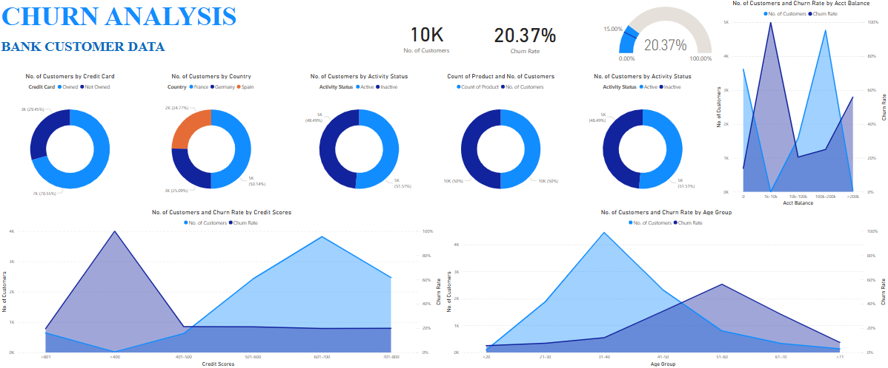
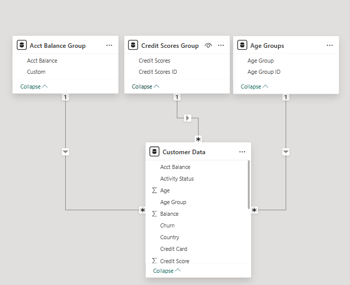

# Sales Insights Data Analysis Project


## Problem Statement

The goal is to analyze customer churn based on factors such as demographics, credit score, financial activity, and account characteristics. 
The objective is to identify trends, key predictors of churn, and provide actionable insights to reduce churn rates.

```bash
The dataset contains 10,000 rows and 12 columns. Here a brief description of the columns:

1. customer_id: Unique identifier (customers).
2. credit_score: Customers credit scores.
3. country: Country of residence (e.g., France, Spain).
4. gender: Gender of the customer (Male/Female).
5. age: Age of the customer.
6. tenure: Duration of the customer relationship (years).
7. balance: Account balance.
8. products_number: Number of products the customer holds.
9. credit_card: Whether the customer owns a credit card (1 = Yes, 0 = No).
10. active_member: Whether the customer is an active member (1 = Yes, 0 = No).
11. estimated_salary: Estimated annual salary.
12. churn: Churn status (1 = Churned, 0 = Retained).
```
### Dashboard Screenshot



### Analysis Approach

`Data Exploration`

1. Understand Trends: Examine distributions of churned vs. retained customers across variables like country, age, gender, and credit score.

2. Correlation: Identify correlations between features like credit score, tenure, balance, and churn rate.

`Dashboard Development in Power BI`

Key Visualizations:

1. Churn breakdown by country (e.g., bar or map chart).
2. Distribution of churn across credit scores.
3. Demographic analysis: churn by gender and age groups.
4. Financial insights: account balance and estimated salary impact on churn.
5. Interactivity: Allow filtering by region, gender, and other key variables.

`Feature Engineering`

1. Create derived features such as balance-to-salary ratio or tenure categories (e.g., new, mid-term, long-term).
2. Modeling and Prediction (optional for further analysis):

Build a predictive model (e.g., logistic regression or decision trees) to identify the probability of churn based on the features.

File Structure:

`data`: CSV file (e.g., `Prediction.csv`)

`powerbi:` Power BI file (e.g., `churn.pbix`)


## Data Analysis Using Power BI

```bash
1. Formula to Create Customer Lost
= Customer Lost = CALCULATE(COUNT('Customer Data'[Churn]),'Customer Data'[Churn] ="Churned")
```
```bash
2. Formula for total number of customer
= No. of Customers = COUNT('Customer Data'[Customer ID])
```
```bash
3. Formula for churn rate
=Churn Rate = 'Customer Data'[Customer Lost]/ 'Customer Data'[No. of Customers]
```

### Clone this repository 
```bash
git clone https://github.com/AviralTechie/Customer_Churn.git
```
